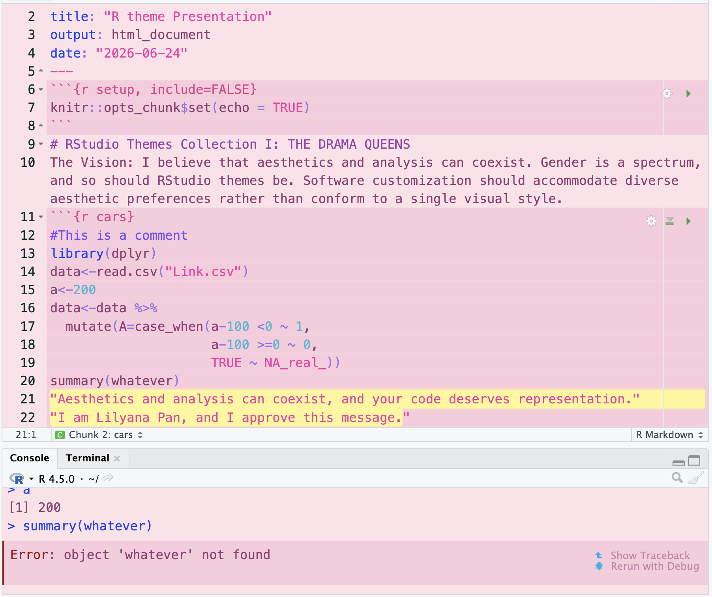
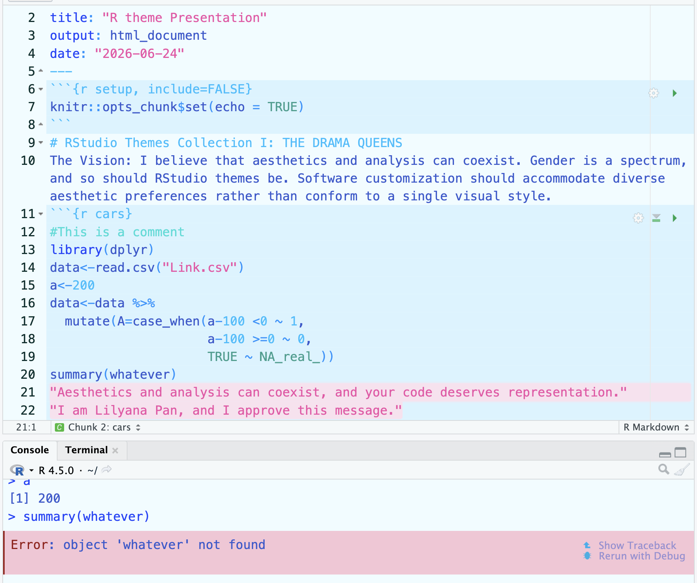
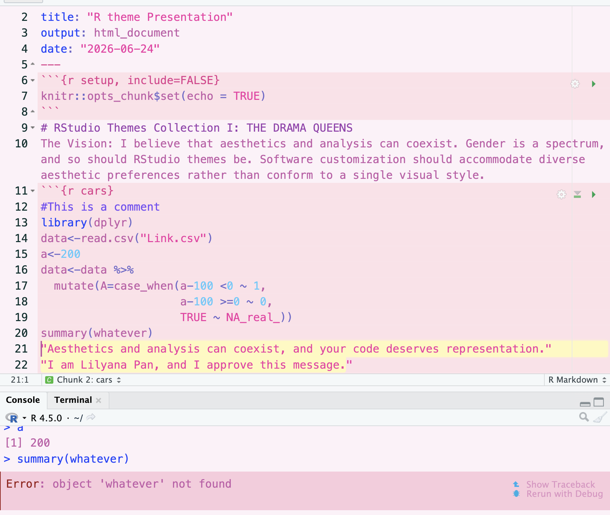

# RStudio Themes Collection I: THE DRAMA QUEENS🌸🌸🌸
Inspired by films, stories, and cosmetics, THE DRAMA QUEENS is a customized RStudio Themes designed by Lilyana Pan. 
The project was initiated on June 23, 2026, and builds upon the code from Ben Harrap's Knitted RStudio theme (&lt;https://benharrap.com/post/two-more-rsthemes/>). Special thanks to Ben Harrap for sharing his work!

## Why RStudio Themes? & Why Choosing THE DRAMA QUEENS? 🌸🌸🌸
While there is a growing number of customized RStudio themes, there has been a lack of relevant themes for RStudio that are vibrant, feminine, and fashion-inspired palettes. For many of us, RStudio has become a handy software through which we conduct statistical analysis. However, existing themes may not fully accommodate users who prefer more varied, expressive, and vibrant color palettes. **I believe that aesthetics and analysis can coexist. Gender is a spectrum, and so should RStudio themes be. Software customization should accommodate diverse aesthetic preferences rather than conform to a single visual style.** **THE DRAMA QUEENS** is therefore a collection of Rthemes that addresses this gap of users' preferences. Drawing inspiration from films (e.g., Barbie), stories, fashion, and cosmetics, the collection celebrates femininity, diversity, inclusion, and self-expression. THE DRAMA QUEENS seeks to make statistical analysis a more colorful, creative, and personalized experience—because **you deserve a coding environment that makes you feel at home🌸.**

## The Collections 🌸🌸🌸
**1. Lilyana's Daydream (June 24,2026)**: Pink, Purple & Romance.
As the first palette of the collection, **Lilyana's Daydream (2026)** captures the vibe of *fantasy*,*dreaminess*, *Barbie-inspired glamour*, and celebration of *womanhood*. Built around shades of *pink*, *purple*, *blue*, and *yellow*, the palette introduces a distinctly feminine, fashion-inspired aesthetic to the RStudio coding environment. The vibrant theme is designed to balance expressive colors with visual comfort during extended coding sessions.

**2. Kiana's Summer (Oct 1, 2026)**: Blue, Turquoise & Ocean。
The second palette, Kiana’s Summer, grasp the essence of tranquil oceans, refreshing summer breezes, and serenity. Rooted in various shades of blue, complemented by turquoise, teal, and playful pink accents, the palette introduces a refreshing, soothing, and ocean-inspired aesthetic.

**3. Lilyana's Daydream Light (Oct 2, 2026)**: Pink, Purple, Barbie Blue, & Periwinkle
A lighter and brighter reinterpretation of the original Lilyana's Daydream, the third palette preserves its signature pink and purple aesthetic while introducing Barbie blue, orchid pink, and dusty periwinkle. The result is a softer, more delicate color palette that celebrates femininity and fantasy.

## How to Use the RStduio Theme 🌸🌸🌸
Option 1: Install via URL
1. Click the `.rstheme` file you would like to install.
2. Click **Raw** in the upper-right corner.
3. Copy the URL from your browser's address bar. The URL should look like something like:https://raw.githubusercontent.com/Lilyanaforever27/THE-DRAMA-QUEENS-RStudio-Themes/refs/heads/main/Lilyana's%20Daydream.rstheme)
4. Open RStudio and run the code below:
```r
rstudioapi::addTheme(
  "PASTE_THE_RAW_URL_HERE",
  apply = TRUE,
  force = TRUE)
```
5. 🎉 Success! Congrats, you did it!!! Welcome to the Fantasy Palette Series. 🌸

Option 2: 
Download the `.rstheme` file.
2. Open **RStudio**.
3. Go to **Tools → Global Options → Appearance**.
4. Click **Add...**.
5. Select the downloaded `.rstheme` file.
6. Choose the theme under **Editor theme**.
7. Click **Apply** or **OK**.
8. 🎉 Success! Congrats, you did it!!! Welcome to the Fantasy Palette Series. 🌸

## Themes Preview 🌸🌸🌸
### 1. Lilyana's Daydream

### 2. Kiana's Summer

### 3. Lilyana's Daydream Light


## Customer Services 🌸🌸🌸
Looking for a personalized color palette or interested in customizing one of our existing themes? I offer free customization upon request!
For customization requests, questions, suggestions, or feedback, feel free to contact me at Lilypan033@gmail.com. Let's make your RStudio as glowing as you are! 💗
